# Массивы
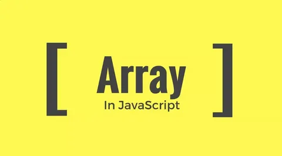
### Объекты позволяют хранить данные со строковыми ключами. Это замечательно.
### Но довольно часто мы понимаем, что нам необходима упорядоченная коллекция данных, в которой присутствуют 1-й, 2-й, 3-й элементы и т.д. Например, она понадобится нам для хранения списка чего-либо: пользователей, товаров, элементов HTML и т.д.
### В этом случае использовать объект неудобно, так как он не предоставляет методов управления порядком элементов. Мы не можем вставить новое свойство «между» уже существующими. Объекты просто не предназначены для этих целей.
### Для хранения упорядоченных коллекций существует особая структура данных, которая называется массив, Array.
# Объявление
### Существует два варианта синтаксиса для создания пустого массива:
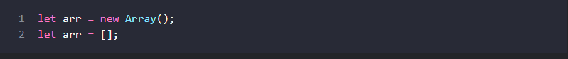
### Практически всегда используется второй вариант синтаксиса. В скобках мы можем указать начальные значения элементов:
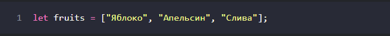
### Элементы массива нумеруются, начиная с нуля.
### Мы можем получить элемент, указав его индекс в квадратных скобках:
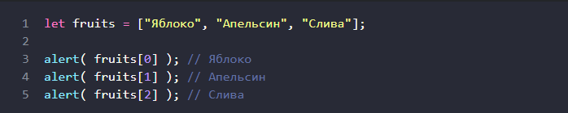
### Мы можем заменить элемент:

### …Или добавить новый к существующему массиву:

### Общее число элементов массива содержится в его свойстве length:
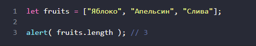
# Методы Массивов

### Массивы предоставляют множество методов. Чтобы было проще, в этой главе они разбиты на группы.
# Методы pop/push, shift/unshift
## pop удаляет последний элемент из массива и возвращает его:
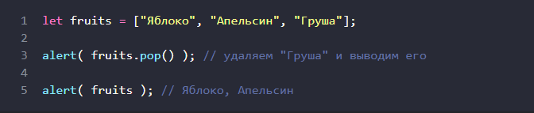
### И fruits.pop() и fruits.at(-1) возвращают последний элемент массива, но fruits.pop() также изменяет массив, удаляя его.
## push Добавляет элемент в конец массива:
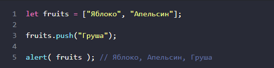
### Вызов fruits.push(...) равнозначен fruits fruits.length = ....
## Методы, работающие с началом массива:
## shift Удаляет из массива первый элемент и возвращает его:
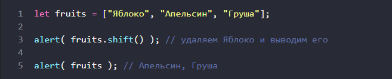
## unshift Добавляет элемент в начало массива:
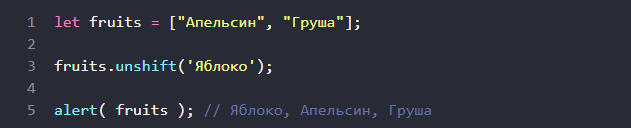
### Методы push и unshift могут добавлять сразу несколько элементов
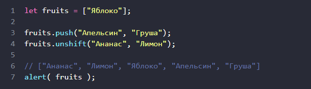
# Другие методы
## Splice
### Метод .splice – это универсальный «швейцарский нож» для работы с массивами. Умеет всё: добавлять, удалять и заменять элементы.
### Он изменяет arr начиная с индекса start: удаляет deleteCount элементов и затем вставляет elem1, ..., elemN на их место. Возвращает массив из удалённых элементов.Этот метод легко понять, рассмотрев примеры.
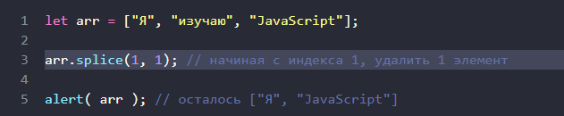
## Slice
### Метод arr.slice намного проще, чем похожий на него arr.splice.
### Он возвращает новый массив, в который копирует все элементы с индекса start до end (не включая end). start и end могут быть отрицательными, в этом случае отсчёт позиции будет вестись с конца массива.
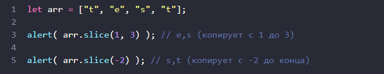
### Можно вызвать slice без аргументов: arr.slice() создаёт копию arr. Это часто используют, чтобы создать копию массива для дальнейших преобразований, которые не должны менять исходный массив.
## Concat
### Метод arr.concat создаёт новый массив, в который копирует данные из других массивов и дополнительные значения.
### Он принимает любое количество аргументов, которые могут быть как массивами, так и простыми значениями.В результате – новый массив, включающий в себя элементы из arr, затем arg1, arg2 и так далее.Если аргумент argN – массив, то копируются все его элементы. Иначе копируется сам аргумент.
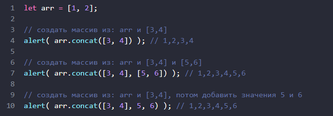
